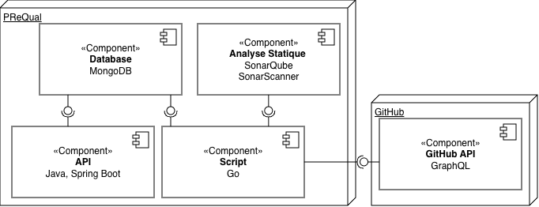

# PReQual

PReQual is an ensemble of tools to create a dataset of pull requests from GitHub with the associated code metrics.
This repository contains an ensemble of tools to generate and query the dataset.

The latest version of the dataset is available in a [Zenodo repository](https://zenodo.org/records/19354721).


## Architecture



The figure above shows the architecture of PReQual. It is composed of four main components:

- **Script** (Go): orchestrates the analysis by querying GitHub Pull Requests through the **GitHub API** (GraphQL) and triggering static analyses.
- **Analyse Statique** (SonarQube + SonarScanner): performs static code analysis on the head branch and the merge base branch of each pull request, computing metrics such as complexity, code smells, or duplicated lines.
- **Database** (MongoDB): stores the collected metrics and pull request data once the analysis is complete.
- **API** (Java, Spring Boot): exposes a REST interface to query the resulting dataset.

## Prerequisites

- [Docker](https://docs.docker.com/get-docker/) and [Docker Compose](https://docs.docker.com/compose/install/)
- [Go](https://go.dev/dl/)
- A GitHub account with permission to generate personal access tokens
- An internet connection to reach the GitHub API

## Installation

### 1. Clone the repo

```bash
git clone https://github.com/snail-unamur/PReQual
```

### 2. Create a docker network for the app

```bash
docker network create prequal-network
```

### 3. Build the tools

```bash
docker compose build
```

### 4. Run the tools

```bash
docker compose up
```

### 5. Setup a SonarQube token

Go to `http://localhost:9000` and login (by default the credentials are 'admin' / 'admin'); it will then ask you to set up a new password.
Then go to the security settings page and generate a new `Global Analysis Token`. Copy the newly generated token and paste it in the `.env` file in the script directory.

### 6. Setup a GitHub token

Go to your [GitHub developer settings](https://github.com/settings/personal-access-tokens) and set up a new token. Once copied, paste it in the `.env` file in the script directory.

## Running an analysis

To run the analyzer script (script directory):

```bash
go run main.go -repos organization/repository
```

Two arguments can be passed:
- `-repos organization/repository(,organization/repository)*`, to specify on which GitHub repositories the analysis will be run.
  - `organization` is the GitHub organization name
  - `repository` is the GitHub repository name
- [Option] `-workspace my-workspace`, to specify the workspace folder for the analysis. The default workspace is `./tmp` in the root script folder.
- [Option] `-metrics flag1,flag2,...`, to specify which SonarQube flags should be included in the analysis. The default is `Cognitive complexity` and `Cyclomatic complexity`. The available flags are listed in the next section; the extended list of flags can be found in SonarQube's official documentation.
- [Option] `-range 0,100`, to specify the range of PRs to analyze. The default is all PRs in the repository.

### Sonar Flags

The SonarQube analysis can be customized by passing flags to the script.
- Cyclomatic complexity -> `complexity`
- Cognitive complexity -> `cognitive_complexity`
- Code smells -> `code_smells`
- Development cost -> `development_cost`
- Duplicated lines -> `duplicated_lines`
- Number of lines of code -> `ncloc`
- Software quality maintainability rating -> `software_quality_maintainability_rating`

For more information, go to Sonar's [official documentation](http://docs.sonarsource.com/sonarqube-server/10.6/user-guide/code-metrics/metrics-definition).

## Querying the dataset

To query the dataset, you can use the Spring Boot API (backend directory).

The Swagger documentation of the API is available at: http://localhost:8080/swagger-ui/index.html.

## Repository structure

```
PReQual/
├── script/      # Go script to query GitHub and trigger SonarQube analyses
├── backend/     # Spring Boot API to query the dataset
└── docker-compose.yml
```
## Citation

If you use PReQual or the associated dataset in your research, please cite the Zenodo repository: https://zenodo.org/records/19354721.